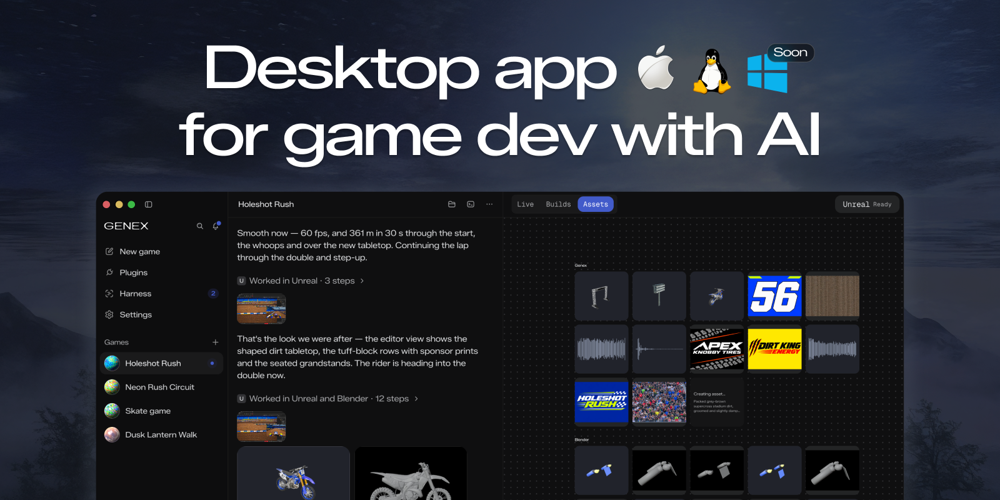

<p align="center">
  <a href="https://genex.games">
    <picture>
      <source srcset=".github/logo-dark.svg" media="(prefers-color-scheme: dark)">
      <source srcset=".github/logo-light.svg" media="(prefers-color-scheme: light)">
      
    </picture>
  </a>
</p>
<p align="center">Desktop app for game dev with AI.</p>
<p align="center">
  <a href="https://github.com/genex-games/genex-desktop/releases/latest"></a>
  <a href="LICENSE"></a>
  <a href="https://github.com/genex-games/genex-desktop/actions/workflows/check.yml"></a>
</p>

<p align="center"></p>

---

### Download

| Platform | Download |
| --- | --- |
| macOS (Apple Silicon) | [`Genex.dmg`](https://github.com/genex-games/genex-desktop/releases/latest/download/Genex.dmg) |
| Linux (x64) | `.deb`, `.rpm` or `.zip` from the [latest release](https://github.com/genex-games/genex-desktop/releases/latest) |
| Windows | Soon |

On macOS, Genex updates itself; on Linux it tells you when a new version is out. Genex is
early: expect rough edges, and tell us about them in
[issues](https://github.com/genex-games/genex-desktop/issues).

### What it does

→ Use your Claude Code or ChatGPT subscription\
→ Or run local models\
→ Multi-agent game dev: mix Opus and GPT models across the main agent, workers and reviewers\
→ Blender, Meshy, Tripo, ElevenLabs and more through the Genex tools router\
→ Export anywhere, or publish to the web\
→ Unity and Unreal plugins soon\
→ Native games in languages like C++ soon

### Contributing

You need macOS on Apple Silicon, Git and Node 24.

```bash
git clone https://github.com/genex-games/genex-desktop.git
cd genex-desktop
nvm install && nvm use   # Node 24, from .nvmrc
npm ci
npm run studio:dev -- start --profile first-run --fixture app-basics
```

The fixture runs the app with scripted models and sample games, so it needs no account. Read
[CONTRIBUTING.md](CONTRIBUTING.md) before you open a pull request; coding agents start at
[AGENTS.md](AGENTS.md).

### Documentation

- [Product overview](docs/agent/context.md): what the app does, with a page per feature
- [Developer field guide](docs/STUDIO-DEVELOPER-FIELD-GUIDE.md): run commands and where data lives
- [Release operations](docs/release-operations.md): packaging, signing and publishing a release

---

[Privacy](PRIVACY.md) · [Security](SECURITY.md) · [MIT license](LICENSE), copyright `genex.games` ·
[Third-party notices](THIRD-PARTY-NOTICES.md)
